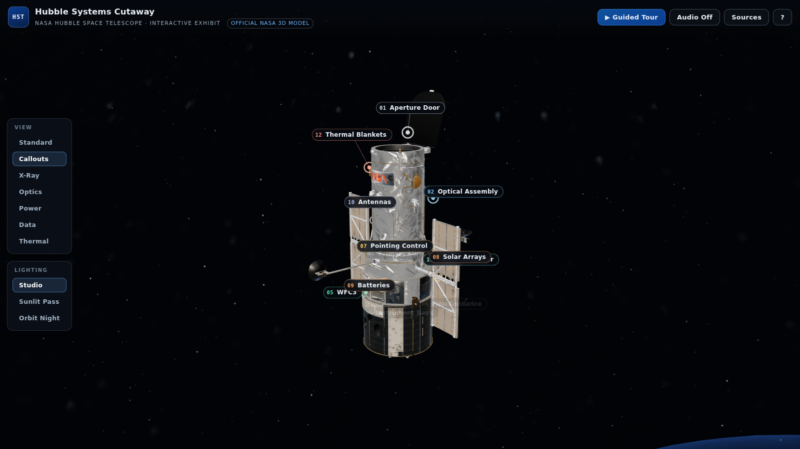

# Hubble Systems Cutaway

An interactive 3D educational exhibit of **NASA's Hubble Space Telescope** —
a museum-kiosk-style web app where you orbit the real NASA 3D model, click
subsystem hotspots, switch cutaway/overlay view modes, and follow a guided
tour through how the observatory actually works.

Built with **Vite + vanilla TypeScript + Three.js** (no framework), using
NASA's official Hubble glTF model, NASA Earth/star imagery, and facts
researched from NASA sources (see `RESEARCH.md`).



## Run it

```bash
npm install
npm run dev       # development server → http://localhost:5173
npm run build     # typecheck + production build → dist/
npm run preview   # serve the production build → http://localhost:4173
npm run verify    # headless-browser screenshot verification → verification/
```

Requires Node 20+. The `verify` script needs a local Chromium (it auto-detects
Playwright browsers or a system install).

## What's in the exhibit

- **Official NASA 3D model** of Hubble (11.5 MB glTF binary) with a procedural
  stand-in fallback if the model fails to load (clearly badged in the UI).
- **12 researched subsystems**, each with a hotspot, highlight volume, camera
  focus, and an info panel covering *what it is / how it works / why it
  matters*, key stats, a NASA photograph, and an explicit
  **confidence label** — `Directly visible on model`, `Placement based on NASA
  reference`, or `Educational approximation`:
  Aperture Door · Optical Telescope Assembly · Primary Mirror · Axial Science
  Instruments · Wide Field Camera 3 · Fine Guidance Sensors · Pointing Control ·
  Solar Arrays · Batteries & Power · Communications Antennas · Computers & Data
  Handling · Thermal Protection.
- **Guided tour** — 11 stops with a progress stepper, camera flights,
  per-stop view modes (the optics stop traces the light path, the power stop
  animates energy flow), next/back/jump, and exit-to-free-exploration.
- **View modes** — Standard, Callouts, X-Ray (ghosted hull + interior
  volumes), and four overlay modes: **Optics** (light path
  aperture → primary → secondary → focal plane), **Power** (wings → battery
  bays → distribution ring), **Data** (instruments → computer/recorder → high-gain
  antenna → TDRS beam), **Thermal** (insulation zones). Selected subsystems
  glow through the hull for the "cutaway" effect — no mesh slicing needed.
- **Lighting presets** — Studio, Sunlit Pass (harsh single-source orbital sun),
  Orbit Night (earthshine). Presets also drive the Earth terminator and
  environment-map intensity so metals respond convincingly.
- **Orbital context** — NASA Blue Marble / Black Marble Earth with a day-night
  shader and atmosphere rim, NASA SVS Milky Way panorama, procedural star field.
- **Audio** (off by default, `M` or the Audio button) — synthesized Web Audio
  ambience + UI tones; no external audio files (see `ASSETS.md` for why).
- **Sources panel** — in-app list of every asset and research source.

### Controls

| Input | Action |
|---|---|
| Drag / right-drag / scroll | Orbit / pan / zoom |
| Click a marker | Inspect subsystem (camera focus + panel) |
| `1–9`, `0`, `-`, `=` | Select subsystem by number |
| `T` | Start / end guided tour |
| `← →` | Previous / next tour stop |
| `V` / `L` | Cycle view mode / lighting preset |
| `M` | Toggle audio |
| `Esc` | Clear selection, close dialogs, exit tour |
| `H` or `?` button | Controls help |

## Project structure

```
public/assets/          NASA model, textures, photographs (see ASSETS.md)
src/
  data/                 ← all content is data-driven
    subsystems.ts       12 subsystems: text, stats, anchors, volumes, views
    tour.ts             guided tour steps
    assetManifest.ts    asset provenance + model calibration constants
    sources.ts          research citations (rendered in the Sources panel)
  scene/                Three.js layer
    SceneManager.ts     renderer/camera/controls/loop
    modelLoader.ts      GLTF load → normalize → ghost mode; fallback wiring
    fallbackHubble.ts   procedural stand-in model (documented fallback)
    frame.ts            normalized "model frame" (t, r, θ) → world mapping
    overlays.ts         hotspots, highlight volumes, flow overlays, occlusion
    environment.ts      starfield, Milky Way, Earth shader, sun disc
    lighting.ts         lighting presets with smooth transitions
    cameraRig.ts        interruptible camera flights
  ui/                   HUD, info panel, tour bar, sources modal, loading, toast
  audio/audioEngine.ts  Web Audio ambience + tones (off by default)
  state.ts              tiny typed store driving scene + DOM
scripts/capture.mjs     headless verification screenshots (npm run verify)
scripts/inspect.mjs     dev helper: prints model node bounding boxes
verification/           screenshots from the last verification run
```

Subsystem positions use a normalized cylindrical **model frame** (axial
fraction, tube radii, azimuth) rather than raw coordinates, so the same data
files drive both the NASA model and the fallback — and another spacecraft
could be added later by supplying a new model + data files.

## Verification

`npm run build` passes (TypeScript strict + Vite). `npm run verify` builds the
screenshots below in headless Chromium (SwiftShader WebGL) against the
production build; the run used the **real NASA model** (`model source: nasa`)
and captured **zero page errors**. Inspected for: non-blank WebGL canvas,
model visible, readable labels/panels, no major layout overlap, tour usable.

| Screenshot | Shows |
|---|---|
| `verification/01-initial-desktop.png` | Initial exhibit, callouts mode, Earth limb, 12 hotspots |
| `verification/02-subsystem-selected.png` | Primary Mirror selected: camera focus, highlight disk through hull, info panel with confidence badge |
| `verification/03-tour-optics.png` | Tour stop 3: light-path overlay with labeled beam (aperture → mirrors → focal plane) |
| `verification/04-tour-power.png` | Tour stop 8: power overlay (wing volumes, flow pulses, battery bays, distribution ring) |
| `verification/05-narrow-viewport.png` | 820 px viewport: info panel as bottom sheet, no clipped UI |
| `verification/06-lighting-sunlit.png` / `07-...night.png` | Sunlit Pass and Orbit Night presets |
| `verification/00-debug-calibration.png` | `?debug=1` anchor-calibration view used during development |

To re-verify locally: `npm run build && npm run verify` (add `--debug` to
`node scripts/capture.mjs` for the calibration shot).

## Known limitations & honest notes

- **Interior placements are educational.** The NASA model is a single textured
  hull; internal volumes (mirror, instrument bays, batteries, computers) are
  overlay approximations placed per NASA's cutaway infographic. Each panel
  carries its confidence label, and `RESEARCH.md` details exact-vs-approximate.
- **Second high-gain antenna volume is approximate** — its stowed pose on this
  particular model is ambiguous.
- **Star map is the 1 K preview** of NASA's Deep Star Maps (full versions are
  EXR-only, 36 MB+); crisp stars come from a documented procedural point field.
- **Audio is synthesized** (documented fallback) — no suitable open-license
  NASA ambience was available via the images.nasa.gov API.
- **Solar wings on the NASA model are stylized** (shorter than real SA3
  proportions); overlays follow the model, stats follow NASA figures.
- Three.js ships as one ~700 KB chunk (185 KB gzip); fine for a kiosk, not
  code-split.
- Desktop-first: phone landscape works but isn't tuned; tablet and narrow
  portrait are verified.

## Credits

3D model, imagery, and research content courtesy of **NASA** (and STScI for
the cutaway reference). NASA does not endorse this project. Full asset
provenance in [`ASSETS.md`](ASSETS.md); research sources in
[`RESEARCH.md`](RESEARCH.md). Application code is original to this repository.
